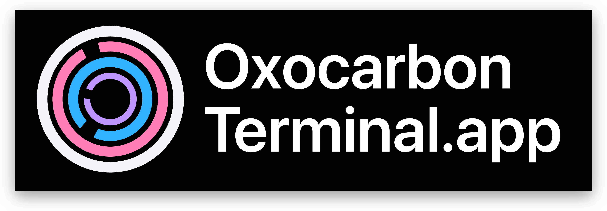

# 

img1

<br>
<br>

img2

<br>
<br>

img3

<br>
<br>

Oxocarbon is a High contrast accessible colorscheme inspired by IBM Carbon. It delivers class-leading readability without strain by adhering to WCAG 2.1 guidelines

## Compatibility

The oxocarbon colorscheme does not traditionally use shades of yellow or green nor bright colors, as it caters to those with protanopia and favors bolding for distinction over brightness. However, we understand some may need a strict ansi colorscheme. Thus, three variant are provided:

- `oxocarbon.terminal` the traditional gray colorscheme you know and love
- `oxocarbon-oled.terminal` the same as `oxocarbon` but with a pure black background
- `oxocarbon-compatibility.terminal` a version of `oxocarbon` that introduces green, yellow, and strictly follows ansi standards

## Install

1. Download a `.terminal` file with the following command where <oxocarbon> is the name of the colorsceme you would like to download

```bash
cd $HOME/Downloads
curl -O https://raw.githubusercontent.com/nyoom-engineering/oxocarbon-terminal-app/main/<oxocarbon>.terminal
```

2. Go to `Settings -> Profiles`, click the three dots in the bottom left side and them select `import`. From the file picker, select the `.terminal` file in your downloads folder
3. Click the profile of your choice, optionally set it as `default` using the right of the three dots

## License

The project is licensed under the MIT license
